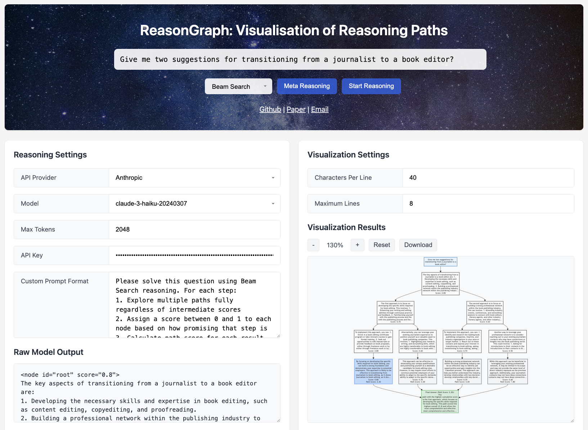

# ReasonGraph: Visualisation of Reasoning Paths

<p align="center">
  <b>Content</b>
</p>

<p align="center">
  <a href="#news">🚀 News</a> •
  <a href="#todo">✏️ Todo</a> •
  <a href="#introduction">✨ Introduction</a>
</p>

<p align="center">
  <a href="#examples">👀 Examples</a> •
  <a href="#environment">🖥️ Environment</a> •
  <a href="#quick use">🎨 Quick Use</a>
</p>

<p align="center">
  <a href="#citation">📌 Citation</a> •
  <a href="#license">🔖 License</a>
</p>
<div id="news">&nbsp;</div>

<p align="center">
  <b>Links</b>
</p>

<p align="center">
  <a href="">Project Page</a> •
  <a href="">Paper</a>
</p>


## 🚀 News

- **[2025.02.26]** A new version has been uploaded.
- **[2025.02.22]** Create the Github page.

<div>&nbsp;</div>
<div>&nbsp;</div>
<div id="todo">&nbsp;</div>


## ✏️ Todo

- [ ] The paper "**ReasonGraph: Visualisation of Reasoning Paths**" is coming!
- [ ] Release the full page.
- [x] Release the demo.

<div>&nbsp;</div>
<div>&nbsp;</div>
<div id="introduction">&nbsp;</div>


## ✨ Introduction

<div>&nbsp;</div>
<div>&nbsp;</div>
<div id="examples">&nbsp;</div>


## 👀 Examples

<details open>
<summary><strong>UI Screenshot:</strong></summary>

<p align="left">
  
</p>

</details>

<details>
<summary><strong>Visualisation of sequential reasoning methods:</strong></summary>

Chain of Thoughts (top-left), Self-refine (top-middle), Least-to-most (top-right), Self-consistency (bottom-left):

<p align="left">
  
</p>

</details>

<details>
<summary><strong>Visualisation of tree-based reasoning methods:</strong></summary>

Plain text (top), Beam Search (middle), Tree of Thoughts (bottom):

<p align="left">
  
</p>

</details>


<div>&nbsp;</div>
<div>&nbsp;</div>
<div id="environment">&nbsp;</div>


## 🖥️ Environment

```
python==3.11.8
requests==2.31.0
openai==1.63.2
together==1.4.1
flask==3.1.0
google==3.0.0
google-genai==1.2.0
google-generativeai==0.8.4
```

<div>&nbsp;</div>
<div>&nbsp;</div>
<div id="quick use">&nbsp;</div>


## 🎨 Quick Use

#### 1. Set up the environment according to Section 🖥️ Environment above.

#### 2. Go to root directory:

<absolute_path>/ReasonGraph/

#### 3. Input the API key:

If you don't enter the API keys, the interface can still run normally, but you won't be able to use the corresponding models for inference.

<absolute_path>/ReasonGraph/api_keys.json

```
{
    "anthropic": "<to be filled>",
    "openai": "<to be filled>",
    "google": "<to be filled>",
    "together": "<to be filled>"
}
```

#### 4. Run the program with a single line of code in the terminal:

```
python app.py
```

#### 5. Open your browser and go to the local URL shown in the output.

<div>&nbsp;</div>
<div>&nbsp;</div>
<div id="citation">&nbsp;</div>


## 📌 Citation

```

```

<div>&nbsp;</div>
<div>&nbsp;</div>
<div id="license">&nbsp;</div>


## 🔖 License

This project is licensed under the Creative Commons Attribution 4.0 International License - see the [LICENSE](https://creativecommons.org/licenses/by/4.0/deed.en) for details.


